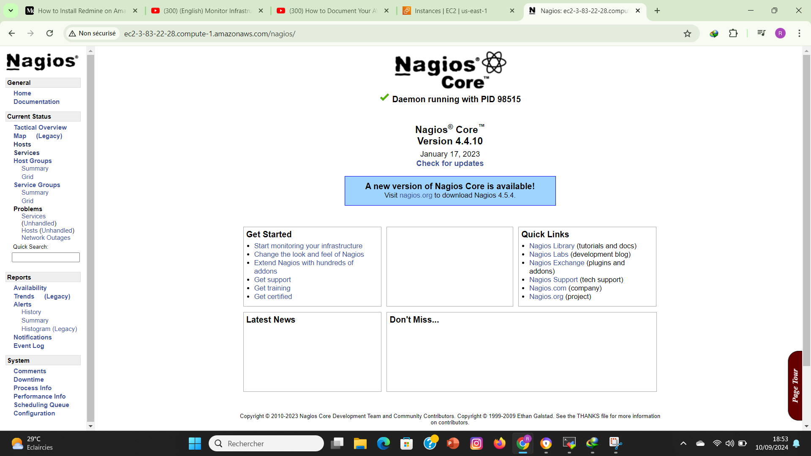

# Nagios Monitoring System Deployment on AWS EC2

## Overview

This project demonstrates how to deploy the **Nagios Open Source Monitoring System** on an AWS EC2 instance running **CentOS** or **Red Hat Enterprise Linux (RHEL) 9/8**. Nagios is a powerful open-source monitoring tool that helps system administrators monitor servers, applications, and network devices. With Nagios, administrators can receive alerts about potential problems before they become critical, allowing for timely interventions.

By the end of this project, you will have a fully functional Nagios server that can be used to monitor your IT infrastructure.

## Prerequisites

Before beginning the installation, ensure the following:

- A running AWS EC2 instance using CentOS or RHEL 9/8.
- Root or sudo user access.
- The server is up-to-date. Run the following command to update your server:

```bash
sudo yum update -y
```

## Architecture Diagram

Below is a diagram illustrating the Nagios monitoring system's architecture deployed on AWS EC2:



## Installation Steps

### Step 1: Install Required Dependencies

Nagios requires certain packages such as Apache, PHP, and GCC to function correctly. Run the following commands to install them:

```bash
sudo yum groupinstall "development tools"
sudo yum install httpd php php-cli gcc unzip wget glibc glibc-common gd gd-devel net-snmp
```

### Step 2: Create Nagios User and Group

Nagios requires a dedicated user and group for its processes. Create them by running:

```bash
sudo useradd nagios
sudo groupadd nagcmd
sudo usermod -a -G nagcmd nagios
sudo usermod -a -G nagcmd apache
```

### Step 3: Download Nagios Core

Download the latest version of Nagios Core (in this example, version 4.4.10):

```bash
wget https://assets.nagios.com/downloads/nagioscore/releases/nagios-4.4.10.tar.gz
tar xzf nagios-4.4.10.tar.gz
```

### Step 4: Compile Nagios Core

Navigate to the extracted directory and compile Nagios:

```bash
cd nagios-4.4.10
./configure --with-command-group=nagios
make all
```

### Step 5: Install Nagios Core

Once the compilation is complete, install Nagios Core by running:

```bash
sudo make install
sudo make install-commandmode
sudo make install-init
sudo make install-config
sudo make install-webconf
```

### Step 6: Install Nagios Plugins

To extend the functionality of Nagios Core, install the necessary plugins:

```bash
wget http://nagios-plugins.org/download/nagios-plugins-2.4.3.tar.gz
sudo tar xzf nagios-plugins-2.4.3.tar.gz
cd nagios-plugins-2.4.3
./configure --with-nagios-user=nagios --with-nagios-group=nagcmd
sudo make
sudo make install
```

### Step 7: Configure Nagios

Open the Nagios configuration file and ensure it is properly configured. You can use the following command to edit it:

```bash
sudo nano /usr/local/nagios/etc/nagios.cfg
```

After making changes, save and close the file.

### Step 8: Set up Authentication

Nagios requires authentication to access the web interface. Create an admin user by running:

```bash
sudo htpasswd -c /usr/local/nagios/etc/htpasswd.users nagiosadmin
```

### Step 9: Verify and Start Services

First, verify the Nagios configuration file:

```bash
/usr/local/nagios/bin/nagios -v /usr/local/nagios/etc/nagios.cfg
```

If no errors are found, enable and start the Nagios service:

```bash
sudo systemctl enable nagios
sudo systemctl start nagios
```

Start the Apache web server:

```bash
sudo systemctl start httpd
```

### Step 10: Access the Nagios Web Interface

You can now access the Nagios web interface. In your web browser, go to:

```
http://<your-server-ip>/nagios
```

Log in with the username `nagiosadmin` and the password you created in Step 8. After successful authentication, you will be directed to the Nagios dashboard.

## Repository Contents

- **Nagios_Architecture_Diagram.png**: The diagram illustrating the Nagios monitoring system's architecture.
- **installation_steps.txt**: Detailed steps for installing and configuring Nagios on an AWS EC2 instance.
  
## Conclusion

In this project, we successfully deployed Nagios Core on an AWS EC2 instance running CentOS or RHEL 9/8. Nagios provides a robust monitoring solution, allowing system administrators to monitor their IT infrastructure effectively.

For further customization and configuration, refer to the [Nagios Documentation](https://www.nagios.org/documentation/).


![Alt text]{Capture d'écran 2024-09-10 185309.png}
